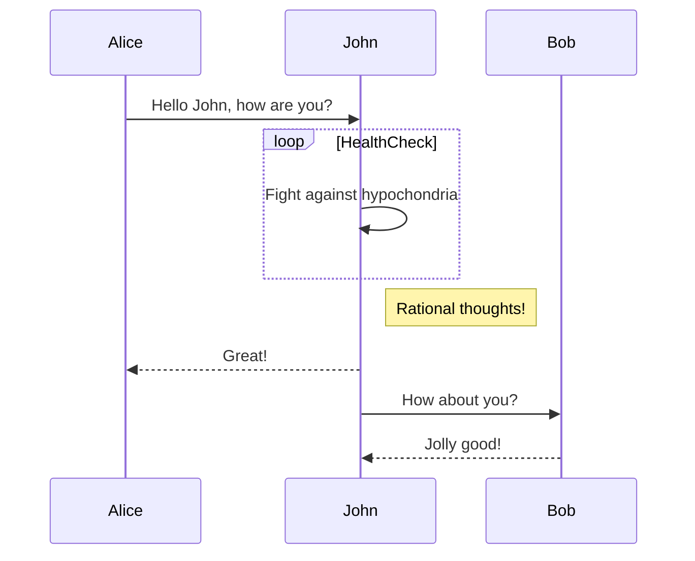

# markdown-mermaid-test

$E = mc^2$

$$
E = mc^2
$$

-- $$
E = mc^2
$$

$$
\begin{pmatrix}
A & B \\
C & D
\end{pmatrix}
$$

$$
\begin{pmatrix}
1 & 2 \\
3 & 4
\end{pmatrix}
$$

$$
\begin{bmatrix}
1 & 2 & 3 \\
4 & 5 & 6 \\
7 & 8 & 9
\end{bmatrix}
$$

